# Schema UML de la Base de Donnees

## Diagramme Entite-Relation (Mermaid)

```mermaid
erDiagram
    BUILDINGS ||--o{ PREDICTIONS : "peut avoir"

    BUILDINGS {
        int id PK "Auto-increment"
        int ose_building_id UK "Identifiant Seattle"
        int data_year "Annee des donnees"
        varchar building_type "NonResidential, etc."
        varchar primary_property_type "Office, Hotel, etc."
        varchar property_name "Nom du batiment"
        varchar address "Adresse"
        varchar city "Ville"
        varchar state "Etat"
        varchar zip_code "Code postal"
        varchar neighborhood "Quartier"
        float latitude "Latitude GPS"
        float longitude "Longitude GPS"
        int year_built "Annee de construction"
        float number_of_buildings "Nombre de batiments"
        int number_of_floors "Nombre d etages"
        int property_gfa_total "Surface totale (sq ft)"
        int property_gfa_parking "Surface parking"
        int property_gfa_building "Surface batiment(s)"
        text list_of_all_property_use_types "Types d usage"
        varchar largest_property_use_type "Usage principal"
        float largest_property_use_type_gfa "Surface usage principal"
        varchar second_largest_property_use_type "Usage secondaire"
        float second_largest_property_use_type_gfa "Surface usage secondaire"
        varchar third_largest_property_use_type "3eme usage"
        float third_largest_property_use_type_gfa "Surface 3eme usage"
        float energy_star_score "Score ENERGY STAR"
        float site_eui "Site EUI (kBtu/sf)"
        float site_eui_wn "Site EUI weather-normalized"
        float source_eui "Source EUI (kBtu/sf)"
        float source_eui_wn "Source EUI weather-normalized"
        float site_energy_use "Consommation totale (kBtu)"
        float site_energy_use_wn "Consommation weather-normalized"
        float steam_use "Vapeur (kBtu)"
        float electricity_kwh "Electricite (kWh)"
        float electricity_kbtu "Electricite (kBtu)"
        float natural_gas_therms "Gaz naturel (therms)"
        float natural_gas_kbtu "Gaz naturel (kBtu)"
        float total_ghg_emissions "Emissions GES (tonnes)"
        float ghg_emissions_intensity "Intensite GES"
        bool default_data "Donnees par defaut"
        varchar compliance_status "Statut conformite"
        varchar outlier "Valeur aberrante"
    }

    PREDICTIONS {
        uuid id PK "UUID v4"
        timestamptz created_at "Date de creation"
        int building_id FK "Lien batiment (optionnel)"
        int number_of_buildings "Input: nb batiments"
        float number_of_floors "Input: nb etages"
        float property_gfa_total "Input: surface totale"
        float property_gfa_parking "Input: surface parking"
        float property_gfa_building "Input: surface batiment"
        float largest_property_use_type_gfa "Input: surface usage principal"
        float second_largest_property_use_type_gfa "Input: surface usage 2"
        float third_largest_property_use_type_gfa "Input: surface usage 3"
        int building_age "Input: age batiment"
        int has_multiple_buildings "Input: multi-batiments"
        float floors_per_building "Input: etages par batiment"
        int has_secondary_use "Input: usage secondaire"
        float distance_to_center "Input: distance centre"
        int has_electricity "Input: electricite"
        int has_natural_gas "Input: gaz naturel"
        int has_steam "Input: vapeur"
        float surface_gas_interaction "Input: interaction"
        varchar building_type "Input: type batiment"
        varchar primary_property_type "Input: type propriete"
        varchar largest_property_use_type "Input: usage principal"
        varchar second_largest_property_use_type "Input: usage 2"
        varchar third_largest_property_use_type "Input: usage 3"
        float energy_prediction_kbtu "Output: energie predite"
        float co2_prediction_tons "Output: CO2 predit"
        float prediction_duration_ms "Duree prediction"
        varchar source "Source (api/script)"
    }
```

## Relations

| Relation | Cardinalite | Description |
|----------|-------------|-------------|
| `buildings` -> `predictions` | 1:N (optionnel) | Un batiment peut avoir 0 ou N predictions associees. Le lien est optionnel car une prediction peut etre faite sans referencer un batiment existant. |

## Notes

- **Table `buildings`** : Contient les 3 376 lignes du dataset Seattle 2016 Energy Benchmarking.
  Les donnees reelles de consommation (`site_energy_use`, `total_ghg_emissions`) servent de reference.

- **Table `predictions`** : Enregistre chaque interaction avec le modele ML (inputs + outputs).
  Assure la tracabilite complete requise par le cahier des charges.
  La colonne `building_id` permet de relier une prediction a un batiment existant pour comparer predictions vs valeurs reelles.

- **Cle primaire `predictions.id`** : UUID v4 pour eviter les collisions et assurer l'unicite sans sequence centralisee.
